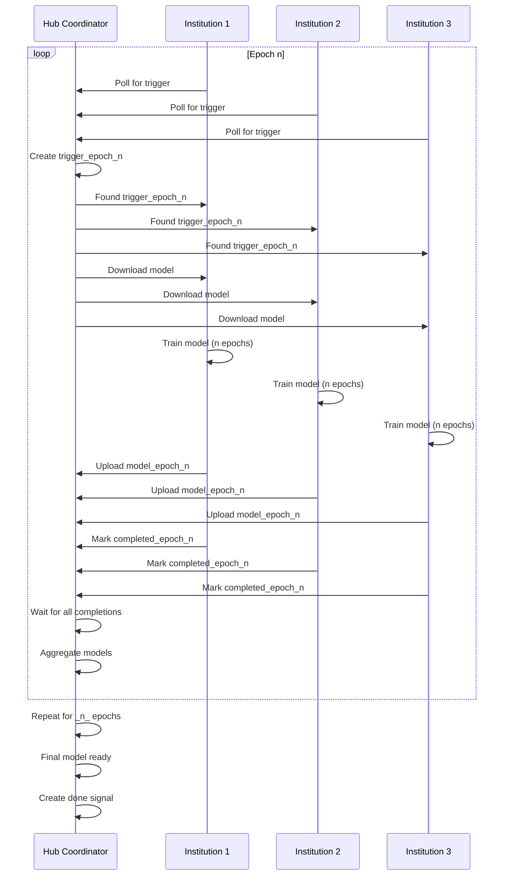

# SCliW Federated Learning

A Slicer CLI Web (SCliW) implementation of federated learning using Nvidia FLARE, enabling institutions to collaborate on model training while keeping their data secure on local servers. Communication between institutions occurs exclusively via the Hub's Girder instance over https.

## Architecture

The system is orchestrated by a central Hub Coordinator responsible for aggregation. Client institutions train on their local data and sync models with the Hub.



### Current Implementation
This repository provides a reference setup demonstrating communication patterns between institutions. The current task utilizes **NVIDIA FLARE** to orchestrate the central aggregation of models.

While this serves as a functional example, the architecture is designed for flexibility. You can swap in custom models or distinct aggregation jobs as needed without altering the underlying data exchange protocol.

## Pre-requisites & Installation

All participating institutions (Hub and Clients) must have some form of the Digital Slide Archive with the ability to run Slicer CLI Web jobs installed. The docker image should be built locally and made available to the Slicer CLI Web instance running on your Girder server.

For general setup instructions regarding Slicer CLI Web installation and task configuration, please refer to the official documentation:
- [HistomicsUI Docs](https://github.com/DigitalSlideArchive/HistomicsUI/docs)
- [Slicer CLI Web Docs](https://github.com/girder/slicer_cli_web)

### 1. Building the Docker Image

From the root of this repository (`scliw-federated`), build the docker image:

```bash
docker build --force-rm -t dsarchive/scliw_federated .
```

### 2. Loading into Slicer CLI Web

Load the built image into your Girder instance's Slicer CLI Web collection. Ensure the tasks `HubFederated` and `ClientFederated` appear in your task list.  An admin user can use the import button on the top right from Collections -> Tasks -> Slicer CLI Web Tasks.

---

## Usage Guide

### A. Hub Coordinator Setup

On the institution acting as the central Hub:

1.  **Create Accounts**: Create individual Girder accounts for every client institution participating in the federation.
2.  **Shared Workspace**: Create a specific Collection or Folder where all participant accounts have `Read/Write` access. This will serve as the workspace for model synchronization.
3.  **Launch the Task**: Navigate to your Slicer CLI Web Tasks list and select `HubFederated` (Collections -> Tasks -> Slicer CLI Web Tasks -> dsarchive/scliw_federated -> latest -> HubFederated).

**Task Parameters:**
- **Work Path**: The path to the shared folder created above (e.g., `/collection/Federated/SharedModelWorkspace`).
- **Epochs**: Total number of federated epochs to run.
- **Clients**: The number of client institutions expected.
- **Reset**: If `True`, clears existing data in the work path before starting.

### B. Client Institution Setup

On each participating institution's server:

1.  **Local Data**: Ensure your private training data is stored locally within your Girder instance or accessible via your Slicer CLI Web setup.
2.  **Load Image**: Ensure `dsarchive/scliw_federated` is loaded into your local Slicer CLI Web.
3.  **Authentication**: Generate a Girder access token for the client account on the Hub (see [Girder Docs](https://girder.readthedocs.io)).
4.  **Launch the Task**: Select `ClientFederated` from your task list (Collections -> Tasks -> Slicer CLI Web Tasks -> dsarchive/scliw_federated -> latest -> ClientFederated).

**Task Parameters:**
- **Client ID**: A unique identifier for this client (e.g., `"Institution_A"`).
- **Work Path**: The exact path to the Hub's shared workspace folder.  This is the same as what the Hub specified.
- **Data Path**: Path to your local training data items on *your* server.
- **Hub Girder API URL**: The URL of the Hub's Girder instance (e.g., `https://hub.girder.example.com/api/v1`).
- **Hub Girder Token**: The access token obtained in step 3 above.

---

### Workflow Summary

1.  **Start**: Hub Coordinator initiates the task, specifying epoch counts and client numbers.
2.  **Sync**: Clients poll the Hub. Upon finding a trigger, they download the current global model weights.
3.  **Train**: Clients perform local training on their private datasets.
4.  **Upload**: Clients upload their updated weights to the Hub workspace.
5.  **Aggregate**: Once all clients have completed their epoch and marked `completed`, the Hub aggregates the models and prepares for the next round.
